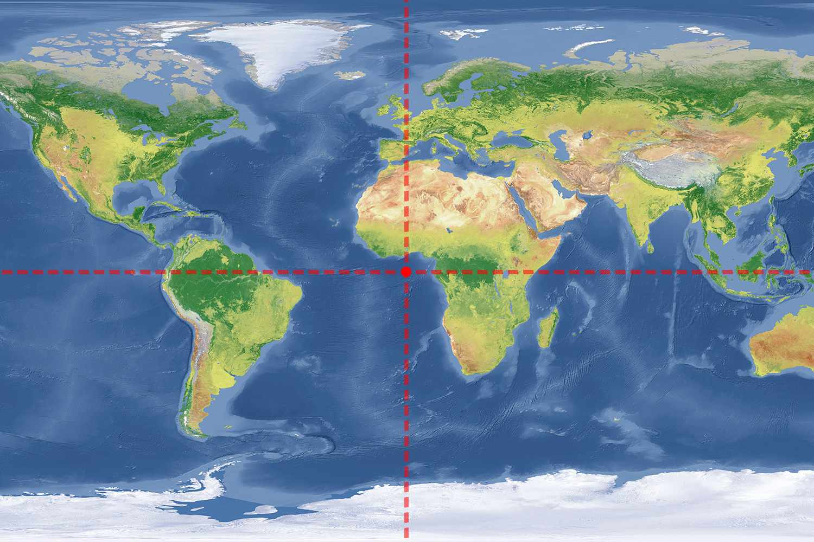
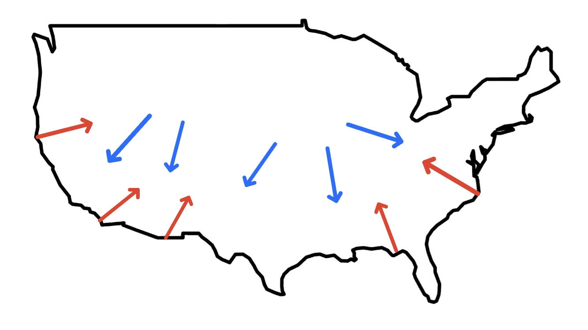
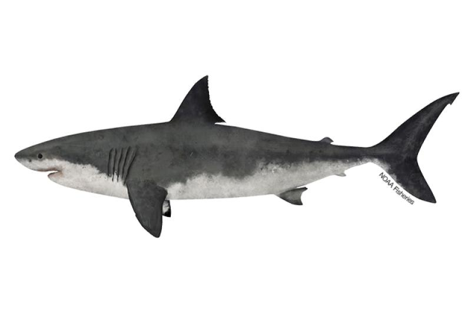

## Introduction of the Situation {.smaller}

- The movie "Sharknado" is a obviously fictional

- Can we estimate the likelihood of a sharknado happening with some realistic environmental constraints?

- Determine if sharknados are simply a product of fiction, or if they have a possibility of happening in real life

{fig-align="center"}

---

## What Data Was Used? {.smaller}

- Data from the National Oceanic and Atmospheric Administration (NOAA) on all United States tornadoes from 1950-2024

```{r, message = FALSE, echo = FALSE}
library(gt)
library(tidyverse)
library(maps)

tornado_vars <- data.frame(
  Variable = c("yr", "date", "st", "mag", "slat", "slon", "elat", "elon", "len", "wid"),
  Description = c(
    "Year Tornado Occurred",
    "Exact Date Tornado Occurred",
    "State Abbreviation Where Tornado First Touched Down",
    "EF Scale Magnitude of the Tornado",
    "Latitude Where the Tornado First Touched Down",
    "Longitude Where the Tornado First Touched Down",
    "Latitude Where the Tornado Ended",
    "Longitude Where the Tornado Ended",
    "Tornado Path Length (Miles)",
    "Tornado Path Width (Yards)"
  ),
  Type = c("Integer", "Date", "Categorical", "Integer", "Numeric", "Numeric", "Numeric", "Numeric", "Numeric", "Numeric"),
  Possible_Values = c("1950-2024", "01-01-1950 to 12/31/2024", "Any US State", "0-5 or -9 Meaning Unknown", "US Latitudes ~ 29 to 50", "US Longitudes ~ -125 to -70", "US Latitudes ~ 29 to 50", "US Longitudes ~ -125 to -70", "0-250 Miles", "0-3500 Yards")
)

tornado_vars %>%
  gt() %>%
  tab_header(
    title = "Tornado Data Variable Descriptions"
  ) %>%
  cols_label(
    Variable = "Variable Name",
    Description = "Description",
    Type = "Type",
    Possible_Values = "Possible Values"
  ) %>%
  tab_style(
    style = cell_text(weight = "bold"),
    locations = cells_column_labels(everything())
  ) %>%
  tab_style(
    style = cell_borders(
      sides = "all",
      color = "black",
      weight = px(1)
    ),
    locations = cells_body(everything())
  ) %>%
  tab_style(
    style = cell_borders(
      sides = "all",
      color = "black",
      weight = px(1)
    ),
    locations = cells_column_labels(everything())
  )
```

---

## Missing Values {.smaller}

- NOAA data set has many "0" values for the ending latitudes and longitudes that are really NA's



---

## Missing Values cont. {.smaller}

- Missing values could be a problem if they have a geographical trend

::: columns

::: column
```{r, fig.width=7}
tornado_full_data <- read.csv("1950-2024_actual_tornadoes.csv") |>
  filter(!st %in% c("AK", "HI", "PR", "VI"))

tornado_paths <- tornado_full_data |>
  distinct(slat, slon, elat, elon, .keep_all = TRUE)

tornado_paths <- tornado_paths |>
  select(slat, slon, elat, elon, mag)

tornado_paths <- tornado_paths |>
  mutate(end_missing = (elat == 0 | elon == 0))

us_states <- map_data("state")

ggplot() +
  geom_polygon(data = us_states,
               aes(x = long, y = lat, group = group),
               fill = NA, color = "black", linewidth = 0.3) +
  geom_point(data = tornado_paths,
             aes(x = slon, y = slat),
             color = "red", alpha = 0.5, size = 0.05) +
  
  labs(title = "Starting Location For All Tornadoes",
       x = "Longitude", y = "Latitude") +
  theme_minimal()

```
:::

::: column
```{r fig.width = 7}
ggplot() +
  geom_polygon(data = us_states,
               aes(x = long, y = lat, group = group),
               fill = NA, color = "black", linewidth = 0.3) +
  geom_point(data = tornado_paths |> 
               filter(elat == 0 | elon == 0),
             aes(x = slon, y = slat),
             color = "red",
             alpha = 0.5,
             size = 0.05) +
  
  labs(title = "Starting Locations of Tornadoes with Missing End Coordinates",
       x = "Longitude", y = "Latitude") +
  theme_minimal()
```
:::

:::

---

## Missing Values cont. {.smaller}

::: columns

::: column
```{r, fig.height=12}
library(ggtext)
ggplot() +
  geom_polygon(data = us_states,
               aes(x = long, y = lat, group = group),
               fill = "gray95", color = "black", linewidth = 0.3) +
  geom_point(data = tornado_paths |> 
               filter(mag != -9),
             aes(x = slon, y = slat),
             color = "red",
             alpha = 0.5,
             size = 0.4) +
  facet_wrap(~ mag, nrow = 3, ncol = 2) +
  
  labs(
    title = "Starting Location All Tornadoes Grouped by Magnitude",
    x = "Longitude", 
    y = "Latitude"
  )
```
:::

::: column
```{r fig.height = 12}
library(ggtext)
ggplot() +
  geom_polygon(data = us_states,
               aes(x = long, y = lat, group = group),
               fill = "gray95", color = "black", linewidth = 0.3) +
  geom_point(data = tornado_paths |> 
               filter(elat == 0 | elon == 0),
             aes(x = slon, y = slat),
             color = "red",
             alpha = 0.5,
             size = 0.4) +
  facet_wrap(~ mag, nrow = 3, ncol = 2) +
  
  labs(
    title = "Starting Location for Tornadoes with Missing End Coordinates Grouped by Magnitude",
    x = "Longitude", 
    y = "Latitude"
  )
```
:::

:::

---

## How Will a Probability Be Computed? {.smaller}


$$
P(\text{shark is present}) \times 
P(\text{tornado is strong enough to lift a shark | tornado is coastal to inland})
$$ 

- We assume that $P(\text{shark is present}) = 1$

- If probability is still extremely low then sharknado risk will be essentially non existent

- Classify each tornado as coastal to inland, inland to coastal, or neither

| **Tornado Type** | **Starting Distance from Coast** | **Ending Distance from Coast** | **Criteria** |
|------------------|-------------------|------------------|------------------|
| Coastal → Inland | ≤ 10,000 m | \> Starting distance | Moves away from coast |
| Inland → Coastal | \> 10,000 m | \< Starting distance | Moves toward coast |
| Other | Could be either | Could be either | Doesn’t meet the 2 criteria for either group |

---

## <span style="font-size: 0.89em;">How Will a Probability Be Computed? cont.</span>

::: {style="text-align:center;"}



<br>

<span style="color:red;">Coastal to Inland</span> |
<span style="color:blue;">Inland to Coastal</span>

:::

---

## Probabilities of Each Type of Tornado {.smaller}

- simply divide the number of tornadoes in the respective category by the number of total tornadoes

```{r, echo = FALSE}
library(rnaturalearth)
library(sf)

tornado_paths <- tornado_paths |>
  filter(end_missing == FALSE)

tornado_paths$start_geom_degrees <- st_as_sf(
  tornado_paths,
  coords = c("slon", "slat"),
  crs = 4269
)$geometry

tornado_paths$end_geom_degrees <- st_as_sf(
  tornado_paths,
  coords = c("elon", "elat"),
  crs = 4269
)$geometry

tornado_paths$start_geom_meters <- st_transform(
  tornado_paths$start_geom_degrees, 5070
)

tornado_paths$end_geom_meters <- st_transform(
  tornado_paths$end_geom_degrees, 5070
)

coast_m <- ne_coastline(returnclass = "sf") |> 
  st_transform(5070)
# Find distances to coast and classify each tornado as coastal_to_inland , inland_to_coastal , or other
tornado_paths <- tornado_paths |>
  mutate(
    dist_start_to_coast = st_distance(start_geom_meters, coast_m) |> apply(1, min),
    dist_end_to_coast = st_distance(end_geom_meters, coast_m) |> apply(1, min)
  )

tornado_paths <- tornado_paths |> 
  mutate(  
    movement = case_when(  
      dist_start_to_coast <= 10000 & dist_end_to_coast > dist_start_to_coast ~ "Coastal_to_Inland",  
      dist_start_to_coast > 10000 & dist_end_to_coast < dist_start_to_coast ~ "Inland_to_Coastal",  
      TRUE ~ "Other"  
    )  
  )
library(knitr)
# Find probabilities of each type of tornado
number_coastal_to_inland <- tornado_paths |>
  filter(movement == "Coastal_to_Inland") |>
  nrow()

number_inland_to_coastal <- tornado_paths |>
  filter(movement == "Inland_to_Coastal") |>
  nrow()

number_other <- tornado_paths |>
  filter(movement == "Other") |>
  nrow()

total_tornadoes <- nrow(tornado_paths)

probability_coastal_to_inland <- 100*(number_coastal_to_inland/total_tornadoes)
probability_inland_to_coastal <- 100*(number_inland_to_coastal/total_tornadoes)
probability_other <- 100*(number_other/total_tornadoes)

tornado_df_for_table <- data.frame(
  category = c("Coastal to Inland", "Inland to Coastal", "Other"),
  number_of_tornadoes = c(number_coastal_to_inland, number_inland_to_coastal, number_other),
  probability = c(probability_coastal_to_inland, probability_inland_to_coastal, probability_other)
)

kable(
  transform(
    tornado_df_for_table,
    probability = sprintf("%.2f%%", probability)
  ),
  col.names = c("Tornado Type", "Number of Tornadoes", "Probability")
)


```

- relatively small amount of coastal to inland tornadoes when compared to inland to coastal and other

- less amount of land close to the coast when compared to the interior of the country

---

## Assumptions for EF magnitude Needed For Sharknado {.smaller}

- Great White Sharks can weigh up to 4,500 lbs

- The average car weighs approximately 4,419 lbs

- EF3 and below tornadoes have not been seen lifting cars significant distances

- Only EF4 and EF5 tornadoes have had the ability to throw cars many feet


::: columns

::: column

:::

::: column

:::

:::

---

## Probability of a Sharknado {.smaller}

- This restriction allows for only one possible sharknado out of the tornadoes we have left

- A sharknado is only possible in $\frac{1}{417} \approx 0.24\%$ of coastal to inland tornadoes.

- This tornado occurred in Florida on April 4, 1966

```{r, fig.height = 6}
florida_tornado <- tornado_paths |>
  filter(mag == 4 & movement == "Coastal_to_Inland")

florida <- map_data("state") |>
  filter(region == "florida")

ggplot() +
  geom_polygon(
    data = florida,
    aes(x = long, y = lat, group = group),
    fill = NA,
    color = "black",
    linewidth = 0.3
  ) +
  geom_point(
    data = florida_tornado,
    aes(x = slon, y = slat),
    color = "red",
    size = 3
  ) +
  labs(
    title = "Only Possible Sharknado Found",
    x = "Longitude",
    y = "Latitude"
  )
```

---

## Conclusion {.smaller}

- Even under favorables assumptions, the risk of a sharknado remains extremely low

- Assumption of sharks being constantly available on the coast represent a significant overestimation

- Analysis could be improved with the distribution of shark locations and physics based modeling of wind speeds required to lift sharks out of the water 

- No adjustment to insurance products is needed and time and resources should be spent on other more likely natural disasters


